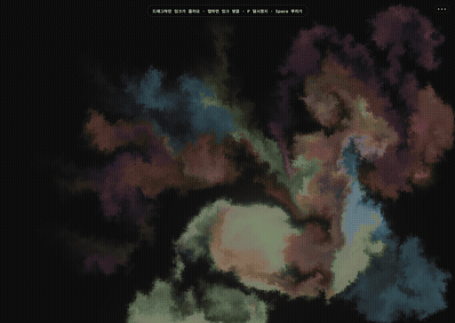

# Natural Instability

**자연스러운 불안정함**

Interactive WebGL Fluid Study

> An interactive WebGL fluid experiment exploring the unstable boundary between gesture, color, and simulated flow.

**[Live Demo](https://yoon-sang-won.github.io/Spreading-ink/)**



---

## About

Natural Instability is a fullscreen WebGL fluid interaction. Drag your pointer across the canvas and your gesture is translated into a flowing trail of ink; a quick tap releases a single ink drop. Two color families — the ink itself and the trail it leaves behind — mix as you move, and the result drifts on its own once you stop.

The piece is a study in *natural instability*: the way a gesture keeps moving after it ends, the way color bleeds into color, the way a small disturbance spreads. It is as much an interaction design experiment as it is a visual one.

The simulation foundation is [WebGL Fluid Simulation](https://github.com/PavelDoGreat/WebGL-Fluid-Simulation) by Pavel Dobryakov (MIT). This project builds on it — the interaction layer, the ink/trail color system, the responsive UI, and the performance and accessibility work described below are the author's own.

---

## What I Worked On

This is an open-source study built on top of an existing MIT-licensed fluid simulation. My contribution is the interaction system and the experience around the simulation, not the simulation itself.

### Interaction

- Click / tap gesture model — a click releases an ink drop instantly, while a drag lays down a flowing trail
- Click vs. drag separation — a movement threshold distinguishes a deliberate drag from a click, so tiny jitters don't paint unwanted marks
- Velocity response — faster gestures produce slightly stronger flow, slower ones leave thicker, heavier ink (tuned to a subtle ±15% range)
- Dual-color ink system — ink and trail colors are independent, so the two families mix in the fluid
- Color palette — eight presets plus a custom color picker for both ink and trail
- Neon mode — an alternate visual treatment that boosts saturation and glow
- Splat and reset actions — burst ink across the canvas or fully clear the fluid state
- Pause — freeze the simulation entirely

### Experience

- Art-first desktop layout — controls are hidden on first load so the simulation is what you see first
- Responsive mobile UI — a hamburger menu, bottom drawer, and mini action bar for touch
- Touch-friendly hit targets — interactive elements expand their hit area beyond their visual size
- About panel — a small, unobtrusive panel explaining the piece and crediting the upstream simulation
- Hint pill — a brief first-visit hint that fades out

### Rendering & performance

- Adaptive device-pixel-ratio cap — rendering resolution is limited based on screen size instead of always using full DPR
- Adaptive dye resolution — simulation resolution stays fixed for fluid quality while the dye (render) resolution is scaled for constrained screens
- Render skipping while paused — the GPU is idle when the simulation is frozen
- Resolution-aware ink size — stroke width scales down on small screens so finger interaction feels proportional

### Accessibility

- `prefers-reduced-motion` support — motion is reduced in intensity (curl, force, bloom) rather than removing the work entirely
- Keyboard-accessible controls — all controls are semantic buttons with labels
- Keyboard shortcuts — `P` to pause, `Space` to burst ink, `Esc` to dismiss panels (shortcuts are disabled while typing in inputs)
- Focus-visible outlines — keyboard focus is visible without cluttering mouse interaction

---

## Interaction

| Action | Result |
| --- | --- |
| Click / Tap | Release an ink drop |
| Drag | Create a flowing trail |
| Faster gesture | Slightly stronger flow |
| Controls | Tune flow, distortion, and stroke width |
| Palette | Choose ink and trail colors |
| Neon | Alternate visual treatment |
| Splat / Reset | Burst ink / fully clear the canvas |
| Pause | Freeze the simulation |

Keyboard shortcuts: `P` pause · `Space` burst ink · `Esc` close panels

---

## Design Decisions

### Gesture over effects

Rather than adding particles or decorative cursor effects, the relationship between pointer velocity and fluid response was tuned. The result is a system where the gesture itself is the effect.

### Art first, controls second

On desktop, controls are hidden by default. The simulation is what you see when you arrive — the UI is a layer you can open, not a dashboard.

### Adaptive rendering

High-DPI environments don't automatically get full device-pixel-ratio rendering. Resolution is capped by screen size and performance, keeping the frame rate steady on large or constrained displays.

### Reduced motion without removing the work

With `prefers-reduced-motion`, the piece isn't disabled — curl, force, and bloom are lowered so the character of the work survives at a calmer intensity.

### Click and drag as separate gestures

A movement threshold keeps a click from painting a trail, so a tap reads as an intentional ink drop rather than an accidental smudge.

---

## Technical Notes

- Vanilla JavaScript
- WebGL / GLSL shaders
- HTML / CSS
- No framework, no build step
- GitHub Pages for hosting

The project has no runtime dependencies. The only external reference is the MIT-licensed upstream simulation (see Credits).

---

## Performance & Accessibility

- Adaptive device-pixel-ratio cap
- Lower rendering (dye) resolution for constrained and mobile environments
- Render skipping while paused
- `prefers-reduced-motion`
- Keyboard-accessible controls
- Semantic buttons / accessible labels
- Touch-friendly hit targets

---

## Project Structure

```text
.
├── index.html              # UI, controls, interaction wiring
├── fluid.js                # Simulation + interaction layer (based on WebGL Fluid Simulation)
├── assets/preview.gif      # README preview capture
├── assets/social-preview.png  # GitHub social preview (1280×640)
├── README.md
├── LICENSE
├── THIRD_PARTY_NOTICES.md
└── .github/workflows/deploy.yml
```

---

## Running Locally

The project is a static site — no install or build step is required.

```bash
python3 -m http.server
```

Then open http://localhost:8000.

Browsers restrict some features (like WebGL texture access) when pages are opened via `file://`, so a local HTTP server is the reliable way to run it.

---

## Credits

Fluid simulation foundation based on **WebGL Fluid Simulation** by Pavel Dobryakov.

Original project: https://github.com/PavelDoGreat/WebGL-Fluid-Simulation

Licensed under the MIT License. The original copyright notice is preserved in `fluid.js` and in [`THIRD_PARTY_NOTICES.md`](THIRD_PARTY_NOTICES.md).

---

## Author

**Yoon Sang Won**

GitHub: https://github.com/yoon-sang-won

---

## License

This project is licensed under the [MIT License](LICENSE). The upstream fluid simulation by Pavel Dobryakov is also MIT-licensed; see [THIRD_PARTY_NOTICES.md](THIRD_PARTY_NOTICES.md).
